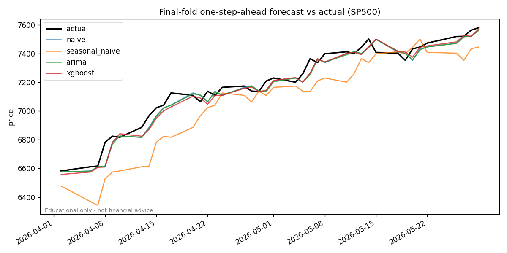

# time-series-market-forecasting


> A small daily price-forecasting pipeline framed as a clean **baseline → statistical → ML** progression, evaluated with **walk-forward validation**.

> [!WARNING]
> **NOT FINANCIAL ADVICE.** This is an educational demonstration of time-series
> methodology only. It must not be used for trading or investment decisions.
> Markets are close to a random walk; past performance does not predict future
> results.

## 1. Project summary
Forecasts the next-day value of a daily financial series (default: the FRED
`SP500` daily index). It compares a naive random-walk baseline, a seasonal-naive
baseline, an ARIMA model, and an XGBoost model on lag/rolling/calendar features —
all judged on the **same one-step-ahead task** under leakage-safe walk-forward
validation. The point is honest evaluation, not a magic predictor.

## 2. Problem statement
Short-horizon price forecasting is the textbook trap for naive ML: a random
train/test split leaks the future and produces fantasy accuracy, and a model
that simply echoes "tomorrow ≈ today" is deceptively hard to beat. This project
shows the disciplined way to do it and reports the uncomfortable truth about how
much (little) signal there is.

## 3. Dataset / source
Daily S&P 500 index from **FRED** (`SP500`), pulled via the keyless
`fredgraph.csv` endpoint (no API key, no licensing friction). ~2,500 trading days
(~10 years). Raw data is **not committed**; see [`data/README.md`](data/README.md)
for the fetch step and layout. Swap the series with `MF_SERIES_ID` (e.g. `DGS10`).

## 4. Approach
The forecasting story, baseline first:

1. **Naive (random walk)** — tomorrow equals today. The reference everything must beat.
2. **Seasonal naive** — repeat the value from one trading week ago.
3. **ARIMA** (`statsmodels`) — differencing handles the non-stationary level.
4. **XGBoost** — gradient-boosted trees on lagged returns, rolling mean/std, a
   price-vs-moving-average distance, and calendar features. **This is the main
   contribution.**

**Leakage safety is the design constraint.** The ML model predicts the next-day
**return** (a stationary target — see the [EDA notebook](notebooks/eda.ipynb):
ADF p≈0.99 for the level vs. p<0.001 for returns) and reconstructs a price from
it, so trees never have to extrapolate price levels. Every feature on day `t` is
a function of data available at the close of day `t` only; nothing reads a future
value (enforced by tests).

## 5. Model / pipeline architecture
`data → features → models (common interface) → walk-forward validation → artifact → serving`.
See [`docs/architecture.md`](docs/architecture.md). All models share one
interface (`fit` / `predict_next` / `forecast`) so the validation loop treats
them identically.

## 6. How to run locally
```bash
uv sync
make check          # ruff + pyright + pytest
make train          # fetch FRED data, run walk-forward, save model + metrics + plot
make run-app        # Streamlit demo (primary)
make run-api        # FastAPI: POST /forecast
```

> **macOS note:** XGBoost needs the OpenMP runtime — `brew install libomp`.

## 7. Results
Walk-forward validation: **5 expanding folds × 40 trading days**, one-step-ahead,
metrics on the price scale. *RMSE skill* is `1 − model_RMSE / naive_RMSE`
(positive = better than the random-walk baseline). Numbers from the latest
`make train` on `SP500`:

| Model            |    MAE |   RMSE |  MAPE % | RMSE skill vs naive |
|------------------|-------:|-------:|--------:|--------------------:|
| naive (baseline) |  40.42 |  51.46 |   0.594 |            baseline |
| seasonal_naive   |  91.28 | 109.26 |   1.336 |              −1.123 |
| arima            |  40.81 |  51.71 |   0.599 |              −0.005 |
| **xgboost**      | **39.85** | **51.10** | **0.586** |          **+0.007** |

XGBoost edges out the naive baseline by a **hair** and ARIMA essentially ties it.
That is the honest, expected outcome for a liquid index — and exactly why the
walk-forward framing and baseline comparison matter more than the model.



*Snapshot committed for display; `make train` regenerates it (alongside
`models/metrics.json` and the model artifact, which are gitignored).*

## 8. Limitations
- **Near-random-walk.** Daily index returns carry little exploitable structure;
  beating naive by a fraction of a percent is not a trading edge.
- **Past ≠ future.** Regime changes, shocks and structural breaks are not modelled.
- **Short horizon.** Evaluation is strictly one-step-ahead; the multi-step serving
  forecast is recursive and degrades quickly — it is illustrative only.
- **No intervals.** Point forecasts only; no uncertainty quantification.
- **Univariate, batch, historical.** No exogenous features and no live data.
- **Not advice.** See the disclaimer above. Do not trade on this.

## 9. Future improvements
Multivariate / exogenous regressors; probabilistic forecasts with prediction
intervals; deep models (LSTM/Temporal Fusion Transformer); a clearly-labelled
non-advice backtest of a trivial strategy; experiment tracking (MLflow).

## 10. What this project demonstrates to employers
- **Time-series correctness:** leakage-safe features, stationarity reasoning, and
  walk-forward (not random) validation — the single most important discipline here.
- **Honest evaluation:** every model benchmarked against a naive baseline with
  skill scores, and results reported even when they are unflattering.
- **Production shape:** typed config, a common model interface, a saved artifact,
  Streamlit + FastAPI serving, tests, and a green CI quality gate.
- **Fintech positioning** with an appropriate, prominent risk disclaimer.
