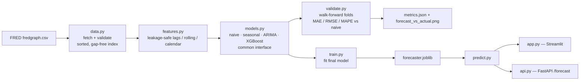

# Architecture

## Diagram

## Components
- **Data layer (`data.py`):** keyless FRED CSV fetch with a local cache; enforces
  a sorted `DatetimeIndex`, no duplicates, no NaNs.
- **Feature layer (`features.py`):** builds lagged returns, rolling mean/std, a
  price-vs-moving-average distance, and calendar features. Row `t` uses only data
  up to the close of day `t`; the supervised target is the next-day return.
- **Model layer (`models.py`):** four forecasters behind one interface
  (`fit` / `predict_next` / `forecast`). The XGBoost model learns returns and
  reconstructs price; ARIMA differences the level; the baselines are exact.
- **Validation layer (`validate.py`):** expanding-window walk-forward splits and
  the metric functions. Guarantees `max(train) < min(test)` per fold.
- **Serving layer (`predict.py` + `app.py` / `api.py`):** loads the fitted
  artifact (no refit on request) and returns a horizon forecast with a disclaimer.

## Data flow
Fetch → validate → engineer features → walk-forward evaluate all models against
the naive baseline → fit the chosen model (XGBoost) on full history → persist
`forecaster.joblib` + `metrics.json` + plot → serve recursive multi-step
forecasts via Streamlit/FastAPI.

## Key decisions
- **Walk-forward, never random split** — the defining correctness choice for
  time-series; a random split leaks the future.
- **Model returns, not price levels** — keeps the target stationary (ADF
  confirms) and sidesteps tree models' inability to extrapolate trends.
- **One-step-ahead, apples-to-apples** — within a fold the model parameters are
  frozen on the train block while features use the actual expanding history, so
  every model is compared on the identical task.
- **Skill vs. baseline reported honestly** — a tiny positive skill is the expected
  result and is shown as such, not dressed up.
